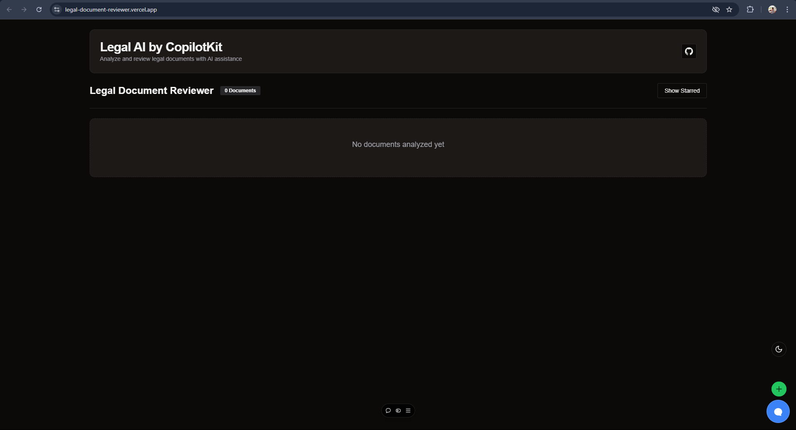
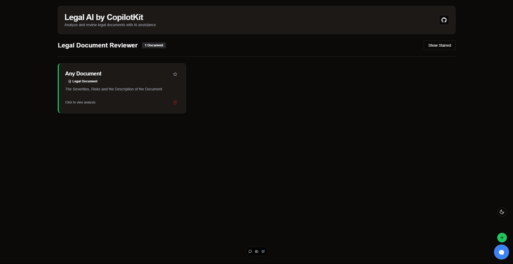

### Legal Document Analyzer

<div align="center">
    
    <h2>Legal Document Reviewer</h2>
</div>

### ⭐ About
A tool which helps non-professional lawyers to understand and improve their legal documents


$~$

<details>
<summary>Screenshots</summary>





</details>

$~$

### 📤 Set up
- These are the steps required to install the project.

1. Get API key from [GROQ](https://console.groq.com).
2. Clone the repo
   ```sh
   git clone https://github.com/ARYPROGRAMMER/Legal-Document-Reviewer
   ```
3. Install NPM packages
   ```sh
   npm install
   ```
4. Enter your API Keys in `.env.local` as stated in `.env.example`.
5. Run development server
   ```sh
   npm run dev
   ```